# WealthOS Architecture Diagram
## v8.2 — corrected from the uploaded v8.0 diagram
### Status: Source of truth (companion to 01-HLD.md)

Your uploaded diagram (v8.0) is preserved conceptually below, with the two corrections applied everywhere they appear: no external/always-on Market Runtime Worker (replaced by Supabase Cron polling), and Trade Execution marked as deferred, not active.

```mermaid
flowchart TB
    subgraph EXT["External World"]
        AngelAPI["Angel One SmartAPI<br/>(REST quote/LTP, polled)"]
        MktProviders["Market Data Providers<br/>NSE / BSE / AMFI / indianapi.in"]
        LLM["LLM Provider<br/>Claude"]
    end

    subgraph LOVABLE["WealthOS Platform (Lovable) — single deployment target"]
        UI["User Client<br/>Web/Mobile UI"]
        RG["Request Gateway<br/>Auth, Validation, Correlation"]
        CG["Capability Gateway<br/>Allow-list, Budgets, Timeouts"]
        Brain["Investment Brain<br/>Understand -> Plan -> Investigate -> Decide"]
        MIP["Market Intelligence Platform<br/>Provider Adapters, Normalize, Freshness"]
        Research["Research Engine<br/>Technical / Fundamental / Valuation"]
        Signals["Signal Layer<br/>10 Signal Families"]
        SigAgg["Signal Aggregation<br/>Instrument x Strategy"]
        Prob["Market Probability Engine"]
        Regime["Market Regime Engine"]
        Anomaly["Anomaly Detection"]
        Portfolio["Portfolio Engine"]
        Rules["Rules Engine<br/>12 Categories"]
        Strategy["Strategy Registry<br/>8 Packs"]
        Watchlist["Watchlist Engine"]
        Discovery["Discovery Engine"]
        Calendar["Market Calendar Service"]
        Validator["Decision Validator"]
        Explain["Explanation Engine"]
        Notify["Notification Engine"]
        Trigger["Trigger Engine"]
        Poller["Supabase Cron Poller<br/>(~60s, market hours only --<br/>NOT an external worker)"]
    end

    subgraph SUPA["Supabase / PostgreSQL"]
        OpData["Operational Data<br/>Portfolio, Watchlist, Preferences, Strategies"]
        MktData["Market Data<br/>live_quotes, candles, fundamentals_cache, market_events"]
        Evidence["Evidence Store<br/>(append-only)"]
        Audit["AI Decision & Audit<br/>brain_runs, decisions, explanations (append-only)"]
        ExecReserved["Execution<br/>(schema reserved -- NOT populated in v1)"]
        Eval["Evaluation<br/>decision_outcomes"]
    end

    UI -->|"question / trigger"| RG
    RG --> Trigger
    Trigger --> Brain
    Brain <-->|"capability requests"| CG
    CG --> MIP
    CG --> Research
    CG --> Rules
    CG --> Portfolio
    CG --> Strategy
    CG --> Discovery
    CG --> Watchlist

    MIP --> AngelAPI
    MIP --> MktProviders
    MIP --> Poller
    Poller -->|"~60s poll"| AngelAPI
    Poller --> MktData
    Poller --> Anomaly

    Research --> Signals
    Signals --> SigAgg
    SigAgg --> Prob
    SigAgg --> Regime
    SigAgg -->|"evidence"| Evidence

    Brain --> Evidence
    Brain -->|"draft decision"| Validator
    Validator -->|"checks against"| Rules
    Validator -->|"checks against"| Calendar
    Validator -->|"PASSED / NO_ACTION / INSUFFICIENT_DATA"| Audit
    Validator --> Explain
    Explain -->|"LLM: prose only"| LLM
    Explain --> Notify
    Notify --> UI

    Brain -.->|"LLM: reasoning"| LLM

    OpData --- Portfolio
    OpData --- Watchlist
    OpData --- Strategy
    MktData --- MIP
    Evidence --- SigAgg
    Audit --- Brain
    Eval -.->|"feeds confidence calibration"| SigAgg

    Brain -.->|"execution_proposal populated,<br/>NOT acted on in v1"| ExecReserved

    style ExecReserved fill:#f5f5f5,stroke:#999,stroke-dasharray: 5 5
    style Poller fill:#e8f5e9,stroke:#2e7d32
    style AngelAPI fill:#fff3e0
```

## Key differences from the uploaded v8.0 diagram

| v8.0 diagram | v8.2 (this diagram) |
|---|---|
| "Market Runtime Worker" drawn inside the Lovable platform box, with WebSocket streaming | Replaced by "Supabase Cron Poller" — same box, but polling (~60s REST), not a persistent WebSocket connection |
| Broker API shown as an active execution path (Order Routing, Execution Reconciliation) | Execution domain shown as reserved/dashed — schema exists, nothing writes to it in v1 |
| No Capability Gateway distinction from Request Gateway | Both shown explicitly — Request Gateway handles inbound auth/validation, Capability Gateway mediates every Brain→Engine call |

This file is the versioned, text-based replacement for the PNG — GitHub/Lovable render Mermaid natively in markdown preview, so it stays viewable without needing an image asset.
